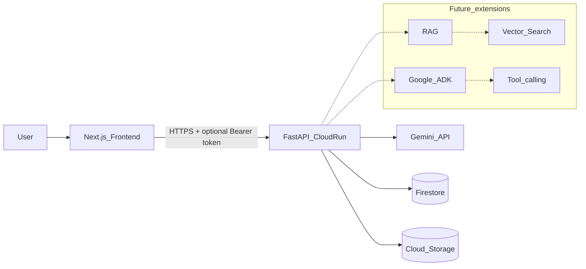

# Architecture

For technology choices, MCP adoption, and decision workflow, see [architecture/technology-decision-process.md](architecture/technology-decision-process.md).

## Overview

This starter is a **monorepo** with a Next.js frontend and a FastAPI backend designed for Google Cloud and Firebase. Competition-specific logic is intentionally left as TODO placeholders.

## System diagram

## Request flow (implemented)

1. User submits text on `/dashboard` → `POST /api/v1/ai/generate`.
2. FastAPI validates input, optionally verifies Firebase ID token when `AUTH_REQUIRED=true`.
3. `GeminiService` calls the Gemini API via `google-genai` (`GEMINI_MODEL`, `GEMINI_API_KEY`).
4. Response JSON returns to the frontend (no API keys in the browser).

File uploads follow the same path through `POST /api/v1/files/upload` with type/size validation; storage upload runs when GCS/Firebase bucket credentials are configured.

## Extension points (not implemented)

| Area | Location | Notes |
|------|----------|--------|
| Structured outputs | `GeminiService.generate_structured_output` | Use `response_schema` in GenAI config |
| Multimodal | `GeminiService.analyze_image` | Pass image parts to `generate_content` |
| Chat / RAG | `GeminiService.generate_with_context` | Firestore + embeddings + vector search |
| Agents | New `services/ai/adk/` | Google ADK when you add agentic workflows |
| Persistence | `FirestoreService` | Chat history, user profiles, activity feed |

## Security model

- Secrets and Gemini keys live only on the backend (Cloud Run env / Secret Manager).
- Frontend uses `NEXT_PUBLIC_*` for non-secret config only.
- Service account JSON files must never be committed.
